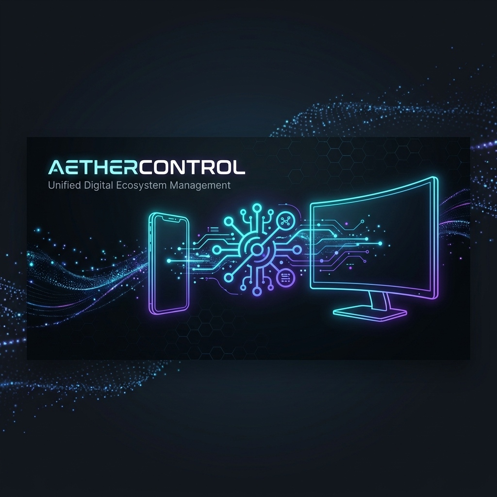
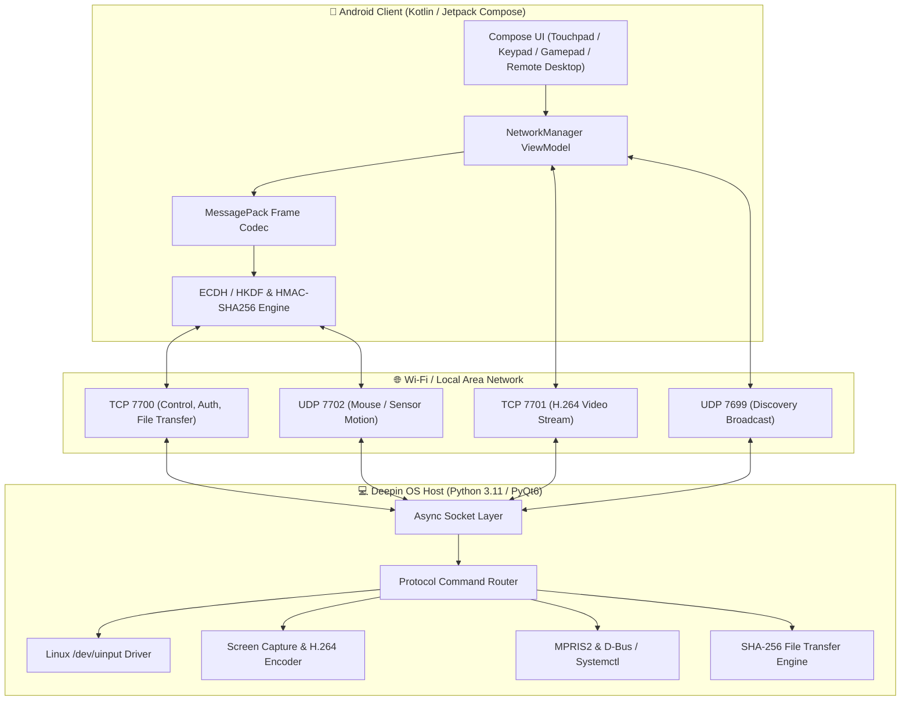

<div align="center">

  

  # 🚀 AetherControl
  **Next-Generation Android-to-Deepin Remote Control Ecosystem**

  [](https://www.deepin.org/)
  [](https://developer.android.com/)
  [](https://www.python.org/)
  [](https://kotlinlang.org/)
  [](#-security-model)
  [](#-license)

  <p align="center">
    <a href="#-overview">Overview</a> •
    <a href="#-key-features">Key Features</a> •
    <a href="#-architecture">Architecture</a> •
    <a href="#-quick-start">Quick Start</a> •
    <a href="#-system-requirements">Requirements</a> •
    <a href="#-security-model">Security</a> •
    <a href="#-protocol-specification">Protocol</a>
  </p>

</div>

---

## 📌 Overview

**AetherControl** turns your Android smartphone or tablet into a powerful, ultra-low-latency wireless controller for your Deepin OS workspace. Emulate touchpads, keyboards, gamepads, stream screen video via H.264, control media playback, synchronize clipboards, and transfer files securely over your local network.

> [!TIP]
> AetherControl uses Linux `uinput` kernel drivers on the host to provide hardware-level mouse, keyboard, and Xbox-compatible gamepad emulation without requiring extra software dependencies on client target games or applications.

---

## ✨ Key Features

| Category | Feature | Status | Roadmap Stage |
| :--- | :--- | :---: | :---: |
| 🖱️ **Input** | Multi-touch Touchpad & Mouse Gestures | `✅ Complete` | [Stage 2](docs/ARCHITECTURE_PLAN.md#stage-2-core-input-controls-) |
| ⌨️ **Input** | Full QWERTY Keyboard & Hotkey Combos | `✅ Complete` | [Stage 2](docs/ARCHITECTURE_PLAN.md#stage-2-core-input-controls-) |
| 🔢 **Input** | Dedicated Numeric Keypad (Numpad) | `✅ Complete` | [Stage 2](docs/ARCHITECTURE_PLAN.md#stage-2-core-input-controls-) |
| 🎮 **Gaming** | Low-latency Virtual Xbox Gamepad | `✅ Complete` | [Stage 3](docs/ARCHITECTURE_PLAN.md#stage-3-gamepad--motion-sensors-) |
| 🎯 **Sensory** | Gyroscope & Accelerometer Motion Steering | `✅ Complete` | [Stage 3](docs/ARCHITECTURE_PLAN.md#stage-3-gamepad--motion-sensors-) |
| 📺 **Display** | Low-Latency H.264 Screen Share Stream | `🔧 In Progress` | [Stage 4](docs/ARCHITECTURE_PLAN.md#stage-4-screen-sharing--remote-desktop-) |
| 🖥️ **Display** | Full Remote Desktop Control | `🔧 In Progress` | [Stage 4](docs/ARCHITECTURE_PLAN.md#stage-4-screen-sharing--remote-desktop-) |
| 🖥️ **Display** | Virtual Extended Secondary Display | `📋 Planned` | [Stage 5](docs/ARCHITECTURE_PLAN.md#stage-5-virtual--extended-display-) |
| 🎵 **Control** | MPRIS2 D-Bus Media Player Remote | `✅ Complete` | [Stage 6](docs/ARCHITECTURE_PLAN.md#stage-6-system--media-control-integration-) |
| ⚡ **Control** | System Power, Volume & Brightness Controls | `✅ Complete` | [Stage 6](docs/ARCHITECTURE_PLAN.md#stage-6-system--media-control-integration-) |
| 🚀 **Control** | Allowlisted Application Quick Launcher | `✅ Complete` | [Stage 6](docs/ARCHITECTURE_PLAN.md#stage-6-system--media-control-integration-) |
| 📋 **Sync** | Real-time Bi-directional Clipboard Sync | `✅ Complete` | [Stage 7](docs/ARCHITECTURE_PLAN.md#stage-7-data--clipboard-synchronization-) |
| 📁 **Sync** | SHA-256 Verified Encrypted File Transfer | `✅ Complete` | [Stage 7](docs/ARCHITECTURE_PLAN.md#stage-7-data--clipboard-synchronization-) |
| 🎨 **Custom** | Drag-and-Drop Control Layout Designer | `📋 Planned` | [Stage 8](docs/ARCHITECTURE_PLAN.md#stage-8-customization--multi-device-management-) |
| 📱 **Multi-Dev** | Concurrent Multi-Device Session Support | `📋 Planned` | [Stage 8](docs/ARCHITECTURE_PLAN.md#stage-8-customization--multi-device-management-) |

---

## 🏗️ Architecture

AetherControl is built with a dual-tier client-server model communicating over dedicated TCP and UDP channels.



### Module Structure

```
AetherControl Repository
├── 💻 desktop/                       # Deepin OS Desktop Host Service
│   ├── aether_server/               # Python core server package
│   │   ├── display/                 # Screen capture (mss/X11, PipeWire) & H.264 encoder
│   │   ├── input/                   # uinput drivers (Mouse, Keyboard, Gamepad)
│   │   ├── media/                   # MPRIS2 D-Bus audio/media controls
│   │   ├── network/                 # TCP/UDP Socket server, HKDF auth, frame handler
│   │   └── system/                  # Power, volume, app launcher allowlist
│   ├── install.sh                   # Automated dependency & uinput permission setup script
│   └── aethercontrol                # Binary starter script
├── 📱 android/                       # Android Client Application
│   ├── app/src/main/kotlin/com/aethercontrol/
│   │   ├── network/                 # Sockets, Crypto engine, MessagePack codec
│   │   └── ui/                      # Jetpack Compose Screens & Theme
│   │       ├── screens/             # Touchpad, Gamepad, Keyboard, Remote Desktop
│   │       └── theme/               # Modern dark-mode color system
│   ├── build.gradle.kts             # Gradle build config
│   └── gradlew                      # Gradle Wrapper script
├── 📜 protocol/                      # Wire Protocol Specifications
│   └── PROTOCOL.md                  # Comprehensive binary framing & packet doc
└── 📖 docs/                          # Documentation & Architecture Plans
    └── ARCHITECTURE_PLAN.md         # 9-Stage Roadmap & Implementation Details
```

---

## ⚡ Quick Start

### 💻 1. Desktop Host Setup (Deepin OS)

```bash
# Navigate to desktop directory
cd desktop/

# Run setup script to install dependencies and configure uinput permissions
./install.sh

# Start the AetherControl server daemon & tray UI
aethercontrol
```

> [!IMPORTANT]
> Linux `uinput` access (for kernel-level mouse, keyboard, and gamepad simulation) requires your system user to belong to the `input` group. The `install.sh` script adds your user automatically, but requires a **logout & login** (or system reboot) for group privileges to take effect.

---

### 📱 2. Android Client Setup

The complete Android client source code is located in the [`android/`](android) directory.

#### Option A: Build using Android Studio (Recommended)
1. Open **Android Studio**.
2. Select **Open** and target the [`android/`](android) folder.
3. Click **Build > Build Bundle(s) / APK(s) > Build APK(s)**.
4. Locate your APK at: `android/app/build/outputs/apk/debug/app-debug.apk`

#### Option B: Build via Command Line (Gradle)
```bash
cd android/
./gradlew assembleDebug
```
The compiled debug APK will be generated at:
`android/app/build/outputs/apk/debug/app-debug.apk`

Transfer the `.apk` file to your Android device and launch the app. It will automatically discover your Deepin desktop on the local Wi-Fi network!

---

## ⚙️ System Requirements

### 💻 Desktop Host (Deepin OS / Linux)
* **Operating System:** Deepin OS 20+ (or mainstream Linux distribution with X11 or Wayland)
* **Python:** Python 3.11+
* **Dependencies:** `PyQt6`, `mss` (X11 capture), `cryptography` (ECDH/HMAC), `msgpack`, `av` (ffmpeg H.264)
* **Optional Packages:** `pipewire` (Wayland capture), `dbus-python` (MPRIS2 media control), `xclip`/`wl-clipboard`
* **Permissions:** Read/Write access to `/dev/uinput`

### 📱 Android Client
* **Operating System:** Android 8.0 Oreo or higher (API 26+)
* **Network:** Wi-Fi connection on the same Local Area Network (LAN) as the desktop host

---

## 🔒 Security Model

AetherControl incorporates enterprise-grade cryptographic security:

* 🔐 **Mutual Device Pairing:** First-time connection requires explicit approval on the desktop tray UI.
* 🔑 **ECDH Key Exchange:** Uses P-256 Elliptic Curve Diffie-Hellman to establish session secrets without sending keys over the wire.
* 🛡️ **HMAC-SHA256 Integrity:** Every single frame (control and fast UDP channels) is authenticated with a 32-byte HMAC tag derived via HKDF-SHA256.
* 🚫 **No Shell Execution:** App quick-launch utilizes strict allowlisting; shell commands are never executed directly.
* 📂 **Path Traversal Shield:** File transfer filenames are sanitized to prevent directory escape attacks.
* 🕵️ **Zero Sensitive Logging:** Passwords, tokens, nonces, and secret keys are stripped from runtime logs.

> [!NOTE]
> Read the complete security architecture in the [Security Model section of PROTOCOL.md](protocol/PROTOCOL.md#authentication).

---

## 📖 Protocol Specification

For full specifications on frame headers, MessagePack payload structures, sequence numbers, and byte layouts, refer to [protocol/PROTOCOL.md](protocol/PROTOCOL.md).

---

## 🗺️ Roadmap & Build Stages

Check out [docs/ARCHITECTURE_PLAN.md](docs/ARCHITECTURE_PLAN.md) for detailed descriptions of all 9 development stages.

- [x] **Stage 1:** Core Networking & Protocol Foundation
- [x] **Stage 2:** Core Input Controls (Touchpad, Keyboard, Numpad)
- [x] **Stage 3:** Gamepad & Motion Sensor Integration
- [x] **Stage 4:** Low-Latency Screen Sharing & Remote Desktop (Active)
- [ ] **Stage 5:** Virtual & Extended Display Subsystem
- [x] **Stage 6:** System & Media Control Integration
- [x] **Stage 7:** Data & Clipboard Synchronization
- [ ] **Stage 8:** Custom Layout Designer & Multi-Device
- [ ] **Stage 9:** Packaging & Ecosystem Polish

---

## 📄 License

Original implementation. All code is original and created for the AetherControl ecosystem under the MIT License.
